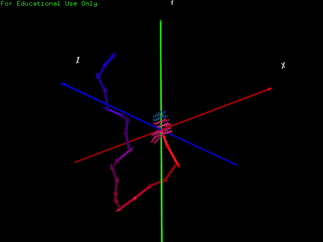

# elfin
A computational protein design tool based on repeat module construction. This is my MEng final year project and is under progress.

The main idea is to use repeatable protein parts like rigid construction blocks and build a shape towards the user's defined shape, very much like Lego. However, there is a non-trivial interaction relationship between the repeat modules: not only are some not compatible with others, they also combine in different but rigid angles.



Figure 1: animated demonstration of how the naive greedy algorithm works towards a complete benchmark shape by building protein modules one after another. The benchmark shape is a randomly generated sequence of protein modules known to have that shape (minimised & shown low RMSD).

### Project Status

16 Mar 2017: Stage 3/4:
   * **GA mostly implemented (~90% as far as this project is concerned)**
      * Includes unit tests of critical code (ideally should be every bit of the code, but I have time constraints)
         * Geomtry & Maths
         * Randomiser & Parallel randomiser
         * Evolution functions
      * Features multiple evolution operators, namely:
         * Crossing (combine 2 highly ranked parents at a random legal point)
         * Point mutation (firstly inherit from one parent, then apply either of {insert, swap, delete})
         * Limb mutation (sever from a random point in sequence, then grow a new "limb")
         * Fully randomise (self explanatory)
      * Implemented straightforward parallelism
         * Simple #pragma omp parallel for
         * Using parallel version of stdlib functions (-D_GLIBCXX_PARALLEL) so I don't need to re-implement stuff like sorting.
         * TODO: further investigate memory access patterns and optimisation opportunities
         * TODO: test on GPUs using OpenMP 4.5
         * TODO: benchmark on a couple of different platforms.
      * TODO: grid search to find good GA parameters
      * TODO: a more complete documentation
      * TODO: write a more visually helpful version of Synth.py to use Kabsch and align two sequences so they can appear to be more aligned in PyMol (instead of fixing one end to origin)

10 Feb 2017: Stage 2/4:
   * **Main Algorithm Formulation**
      * In progress, thinking of a Genetic Algorithm that operates on domain constrained genes.
         * Genes will be sequences of repeat modules restricted by interaction relationship.
         * Main kernel looking to include Kabsch (shape sampling still not solved...) and nearest-point poly-line scoring.
      * Fabio proposed Dead-end Elimination, still need to look into the literature.
         * Consider as alternative but no time to implement every possible algorithm 

8 Feb 2017: Stage 1/4 complete:
   * **Pair and single module library**
      * Cleaned and generated, available as ./lib/python/GenXDB.py
      * Produced a file called xDB.json in ./res/ containing the necessary matrix transformation data.
   * **Benchmark protein (PDB) generator**
      * Done, available as ./lib/python/GenBench.py
      * Generated 10 fully random, length-10 benchmarks. They are found in in ./bm/
   * **Benchmark protein validation**
      * Done using Rosetta minimisation, results in ./bm/l10/scores/
      * Simple output extraction script available as ./lib/python/RMSDStat.py
      * Be ware of lever-effect - in our case shapes are mostly elongated rather than globular, hence the RMSD of around 5 should be acceptable.
      * Out of 10 random benchmark shapes only 1 slightly exceeded RMSD of 5, which is supposedly the international competition standard.
   * **Shape specification method**
      * Done, using a Matlab script available as ./lib/matlab/drawPoints.m
      * It spawns a figure that lets you draw a shape, and auto-scales to the appropriate size (protein-like scale using average module center distances).
      * Copy the point data into a .csv file without the square brackets.
         * TODO: auto export... maybe?
      * Some "fun" examples e.g. alphabets and "simple" shapes are found in ./bm/fun/*.csv
   * **Naïve greedy algorithm**
      * Done, available as ./lib/python/Greedy.py
      * Test scripts available as ./tests/Test*.py
      * Passed positive control test
      * Fails badly in Lv2 (oversampled) and Lv3 (under-sampled) inputs due to spiral dead-end modules, 
         * This is expected because once the naïve algorithm makes a mistake due to its "myopia", it can run into a "spiral" type module that causes collision and be forced to terminate prematurely before meeting length criteria.
      * Can take either JSON (e.g. those in ./bm/l10/) or CSV (e.g. those in ./bm/fun/) as input target shape
   * **PyMol integration***
      * Benchmark generation supports drag-and-drop, found in ./lib/python/GenBenchmark.py
      * Axes and CSV drawing functions available in ./pymol/elfin.py
         * TODO: replace line with cylinders to make width actually work


### Setup 
1. Install all of [must-have tools]() and optionally [complementaries]()
3. Execute the following commands to install necesssary libraries:
```
cd elfin                         #if not already in the directory
virtualenv venv                  #the name 'venv' is required
. ./activate                     #get into the virtual environment
pip install -r requirements.txt  #automatically fetch and instally the libraries needed (locally)
git submodule init		 #my jutil repository is needed for this project
git submodule update
```

### Must-have Tools: 
1. Python 2.7.9+
2. [VirtualEnv](https://virtualenv.pypa.io/en/stable/) for separation of python environment

### Optional Complementaries:
1. [PyMol]() for 3D visualisation of PDB and CSV
2. [Rosetta](https://www.rosettacommons.org/software/license-and-download) for minimisation and confirmation of results
